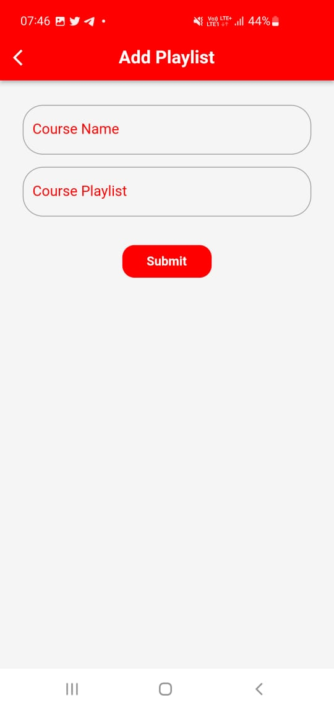
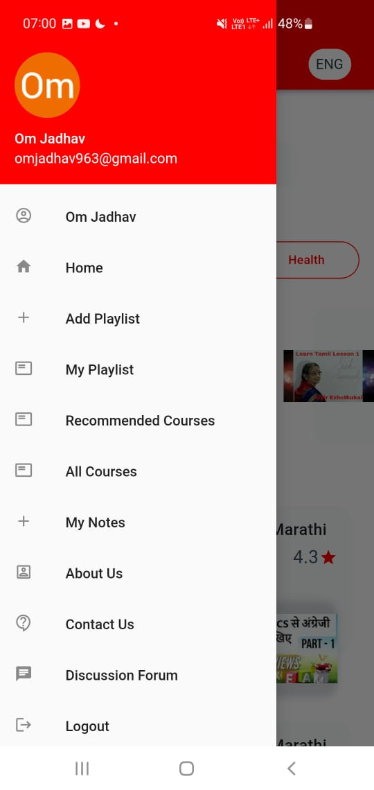

# GoalTube - Get Certified to Watch YouTube!

## AI platform to get credibility by watching Youtube Tutorial Videos

### Team name: AstheTECH

## Team members

- Abhay Ubhale - abhayubhale.30@gmail.com
- Neel DandiWala - neeldandi@gmail.com
- Om Jadhav - omjadhav963@gmail.com
- Hasnain Sayyed - hasnainsayyed833@gmail.com

## Problem Statement

Problem Statement #10: Develop an Ai-powered platform that enhances personalized learning experiences for K-12 students.

## Description
- We believe that education should be free for all!
- A lot of people can't afford to pay for courses on various Edtech platforms like Coursera, Udemy, etc.
- Because technology is constantly being updated, YouTube serves as a platform for these updates to reach a large audience.
- Thus, learning through Youtube is the only way out for most of the curious students. But, watching Youtube tutorials does not provide credibility to showcase as a criteria of employability or gained skills.
- As a result, we created an interactive and user-friendly mobile application that will aid in the personalised learning of the students through YouTube playlists.

- GoalTube is an AI platform that provides credibility to learners across all backgrounds through our dynamic and customizable test who aim to educate themselves through platforms like YouTube.
- The content creators or teachers can sign in with their Google account and add the YouTube playlist that they want to display on our platform. The Playlist will not be added to the course list until it has been approved by the admin panel. Following videos, the user will be required to complete a quiz in which the questions are generated based on the subtitles extracted from the video using NLP(Natural Language Processing). Users can also view and watch playlists uploaded by other users.
- If a user believes that a question or answer is incorrect, they can report it to the admin panel, and the admin panel will investigate further.
- User will be recommended courses based on their previous course history and ratings.
- If the user receives a certain number of passing points at the end of all videos and quizzes, they will be certified for that course.

## Links

- GitHub Repo link: [Link to GitHub repository](https://github.com/omjadhav3714/Rajasthan-IT-Day-Hackathon-)

- APK Google Drive link : [Google Drive Link](https://drive.google.com/drive/u/8/folders/1dSLQCkNC2poz3H25hT1A7XJcI9UVMQlq)

## Revenue Model
- We would be showing advertisements in between the navigation from videos in the same course.
- We would also be going for custom in-app advertisments from various vendors
- We are not planning to charge students at all, as we believe that taking education is everyone's fundamental right and it should always be free!

  ### Benefit to Creators / Teachers
    - The revenue generated from there course through displaying various advertisements would be shared with them!
    - This will keep them motivated to upload more and more content and market their courses themselves

  ### Benefits to Students
  - Students will get the certificate which they can show to there recuiters or school as a proof of eligibility and credibility

## Applications

- GoalTube's most important application is that it can be used by anyone. Because it is not at all paid and even YouTube courses are becoming more credible, it will undoubtedly benefit students who cannot afford paid courses from Udemy, Coursera, and others.
- If it is published in collaboration with a government entity, the credibility of the certificate for courses will be enhanced even further, and the application can be made available to more schools and colleges.
- We can also use the quiz to determine whether or not the user is watching the video. Furthermore, testing your knowledge is a way to gain confidence in that subject, and thus our application will motivate users to complete the courses.

## Future scope

- Peer to peer quiz rounds after each video in a playlist - At the end of every video, the user will be asked to submit few questions along with their answer related to that video. This submitted quiz questions will be then shown to other users.
- Automate Admin panel -As the number of users grows, so will the number of playlist requests. As a result, we will implement an ML Model that will accept or deny requests based on the videos in the playlist, reducing manual work.

## Screenshots

|  |  |  |  |
| :------------------------------------------: | :----------------------------------------: | :----------------------------------------------: | :------------------------------------------------: |
|              Onboarding Screen               |                  HomePage                  |                  Multi Language                  |                    Add PlayList                    |

|  |  |  |  |
| :------------------------------------------------: | :------------------------------------------: | :------------------------------------------------------: | :----------------------------------------------: |
|                     Video Page                     |                  Notes Page                  |                    Recommended Video                     |                 Chat Discussion                  |

|  |  |  |  |
| :----------------------------------------------: | :------------------------------------------: | :----------------------------------------------: | :-----------------------------------------------: |
|                  Video Playlist                  |                  Quiz Page                   |                   Quiz Result                    |                 Certificate Page                  |

|  |  |  |  |
| :-------------------------------------------: | :------------------------------------------: | :------------------------------------------------------: | :-------------------------------------------: |
|                 Profile Page                  |                    Slider                    |                    Recommended Video                     |                 Contact Page                  |

- **Admin Panel**

## Technology stack

Tools and technologies that you learnt and used in the project.

1. Flutter (Dart)
2. Firebase FireStore
3. YouTube API
4. Python Flask
5. PyTorch
6. Material UI
7. Google Collab
8. NLP

## Project Setup

- For this project, install the latest version of Android studio with SDK version of Flutter 2.8 and then install the Flutter plugin in Android Studio. The steps to do so are:
  > Open Android studio -> Go to setting -> Plugins -> Search dart and flutter -> Install and enable them -> Restart IDE.
- Run the command flutter doctor in the terminal on Android studio to check if there are any issues.
  > flutter doctor

### For Android

- Install the SDK command-line tool. After that, you can either connect your phone to Android Studio or run the app on the emulator.

  > Connect your phone:
  >
  > - Turn on Developer option on your physical smartphone device and enable USB debugging ([can refer to](https://www.youtube.com/watch?v=W7nkxS9LMXs))
  > - To check whether your device is connected to your computer, run the command:
  >   > adb -l devices

  > Connect your emulator:
  >
  > Open Android studio -> Go to Device Manager -> Select your device -> Click on run button.
  >
  > - If no device is exists, you can create a new virtual device by clicking on the "Create Device" button.

- In order to run the app, all dependencies must be installed. To do so, run the command:
  > flutter pub get
- After all the dependencies are installed, you can run the app by running the command:
  > flutter run -d <device_id> --no-sound-null-safety
  >
  > - For physical smartphone device:
  >   - The device_id would be your IMEI number.
  > - For virtual emulator device:
  >   - Open Emulator Settings -> Go to help -> About -> Copy the ADB serial number.

### For IOS

- You will need to install Xcode IDE from app store.
  > Open Xcode -> Go to Preferences -> Accounts -> Add Apple ID -> Sign in with your Apple ID.
- After that, you can either connect your phone to Xcode or run the app on the emulator.

  > Connect your phone:
  >
  > - Turn on Developer option on your physical smartphone device and enable USB debugging ([can refer to](https://www.youtube.com/watch?v=AYNhO9dcbBI))
  > - To check whether your device is connected to your computer, run the command:
  >   > xcrun simctl list
  > - If your device is not listed, you can add it by running the command:
  >   > xcrun simctl add <device_name> <device_type>
  >   >
  >   > - device_name: Name of the device
  >   > - device_type: Type of the device (can be found by running the command: xcrun simctl list devicetypes)
  > - After adding the device, you can run the app by running the command:
  >   > flutter run -d <device_id> --no-sound-null-safety
  >   >
  >   > - The device_id would be your IMEI number.

  > Connect your simulator:
  >
  > Open Xcode -> Select ios simulator -> Click on launch icon.

### For Machine Learning Models

- For Question Generation model in the "QuestionGeneration" folder, run the following commands first in your local copy

  - Libraries
    > pip install -r requirements.txt

  > pip install git+https://github.com/ramsrigouthamg/Questgen.ai

  > pip install git+https://github.com/boudinfl/pke.git@69337af9f9e72a25af6d7991eaa9869f1322dd72

  > python -m nltk.downloader universal_tagset

  > python -m spacy download en

  - Download and extract zip of Sense2vec wordvectors that are used for generation of multiple choices.
    > wget https://github.com/explosion/sense2vec/releases/download/v1.0.0/s2v_reddit_2015_md.tar.gz

  > tar -xvf s2v_reddit_2015_md.tar.gz

## Usage

- After installing the apk on your device, you will see a splash screen with beautiful animation displaying the app's name. After that, a series of animated screens will appear before you reach the login screen.
- You can login using your google account which will read your profile name, email, phone and photo and store them in the database as user data.
- Once logged in, you will see multiple courses uploaded by other users on the home page, which you can complete or request the playlist of your choice.
- When you click on the side drawer option on the app bar, you will see the option to "Add playlist", where you can enter the course name and YouTube playlist link before submitting the course to the admin panel for approval. You can view the course in the "My courses" option once it has been approved by the admin panel.
- When you click view more on any course, you will be able to see the course's ratings as well as all of the videos in two different views: grid view and list view. You can watch the YouTube video in the app by clicking on the video thumbnail. After watching the videos, you can attempt the quiz and get a passing score to receive certificate.
- You can switch between multiple languages by clicking on the language option in the upper side corner.

## Flowchart

